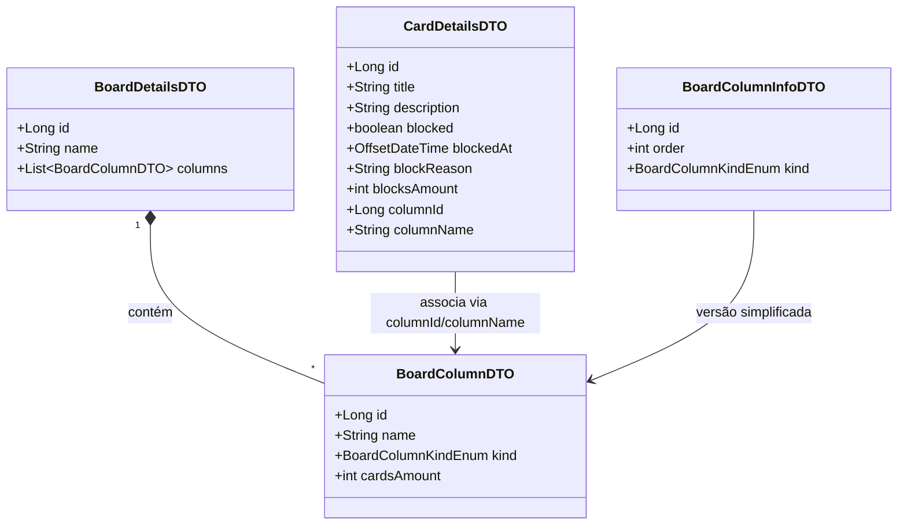

# Board de Tarefas em Java

Este projeto é um sistema de gerenciamento de tarefas no estilo Kanban, feito em Java. A ideia é ter um quadro (Board) onde você organiza suas tarefas em colunas, como "A Fazer", "Fazendo" e "Feito". Cada tarefa é um card que pode ser movido entre essas colunas.

O Board é o coração do sistema. Ele tem um nome e um ID único. Dentro dele, ficam as colunas (BoardColumn), que definem em qual etapa a tarefa está. Cada coluna tem um tipo (kind), como "workflow" ou "backlog", e uma ordem para saber como ela aparece no quadro.

Os cards (Card) são as tarefas em si. Eles têm um título, uma descrição e informações como quando foram criados ou se estão bloqueados. Quando um card é bloqueado, o sistema guarda o motivo e quando isso aconteceu.

Para facilitar o trabalho com a API, foram criados alguns DTOs (objetos que carregam apenas os dados necessários). O BoardColumnDTO mostra uma coluna com quantos cards ela tem. O BoardColumnInfoDTO é mais simples, só com o básico como ID e ordem. O BoardDetailsDTO junta tudo: o quadro, seu nome e a lista de colunas com seus cards. Já o CardDetailsDTO traz todos os detalhes de um card, incluindo se está bloqueado e em qual coluna ele está.

Foi usado o IntelliJ para desenvolver e o DBeaver para ver e mexer no banco de dados. Os DTOs ajudam a manter o código organizado, especialmente quando a API precisa mandar ou receber dados do front-end.

## Diagrama

